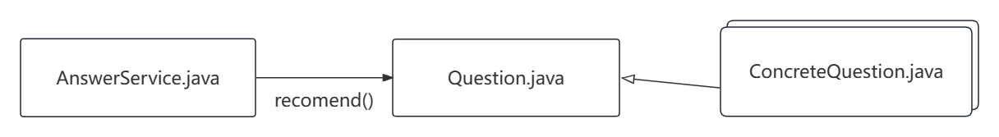

# 博客推荐设计方案

| 变更人 | 变更日期 | 变更内容     |
| ------ | -------- | ------------ |
| 何富森 | 11.24    | 新增设计方案 |

[toc]

## 1. 方案设计

设计思路：

1. 根据每一个模板问题，每个模板问题总是绑定着特定的技术点，推荐该问题下的相关博客。
2. 在“工具”，“应用”节点具有技术领域及技术类型属性，可以根据技术的相关度推荐不同技术及博客。
3. “博客”节点下有`isExcellent`属性，可以根据博客优异程度推荐博客。

## 2. 代码实现

主要的实现类如下：

```powershell
	└─question
            ApplicationBlogQuestion.java
            ApplicationDescriptionQuestion.java
            DeployBlogQuestion.java
            FeatureBlogQuestion.java
            FeatureDescriptionQuestion.java
            PLConsQuestion.java
            PLDifferenceQuestion.java
            PLProsQuestion.java
            Question.java
            RubyApplicationQuestion.java
            RubyBlogQuestion.java
            RubyConsQuestion.java
            RubyDescriptionQuestion.java
            RubyFeatureQuestion.java
            RubyPLQuestion.java
            RubyProsQuestion.java
            RubyToolQuestion.java
            ToolBlogQuestion.java
            ToolDescriptionQuestion.java
```

代码示例如下：

```java
    @Override
    public List<Blog> recommend() {
        ApplicationNode application = applicationRepository.findByName(name);
        List<Blog> result = Lists.newArrayList();
        result.addAll(application.getBlogs().stream().filter(each -> each.getType().equalsIgnoreCase(type)).toList());
        if (result.size() < 20) {
            result.addAll(application.getBlogs().stream().filter(Blog::isExcellent).toList());
        }
        if (result.size() < 20) {
            List<Blog> normalBlogs =
                    Lists.newArrayList(application.getBlogs().stream().filter(each -> !each.isExcellent()).toList());
            result.addAll(normalBlogs.subList(0, Math.min(20 - result.size(), normalBlogs.size())));
        }
        return result;
    }
```

调用图如下：



